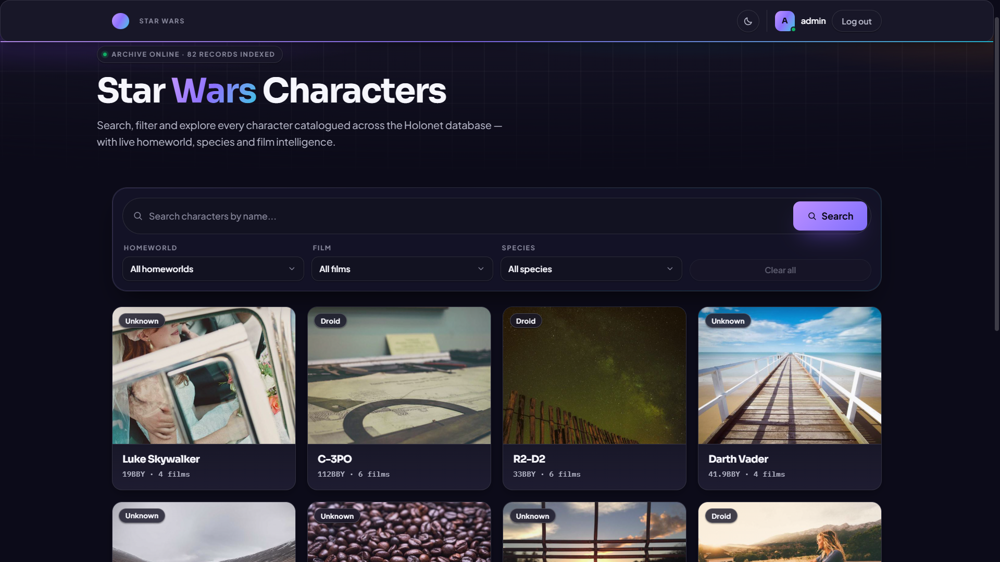
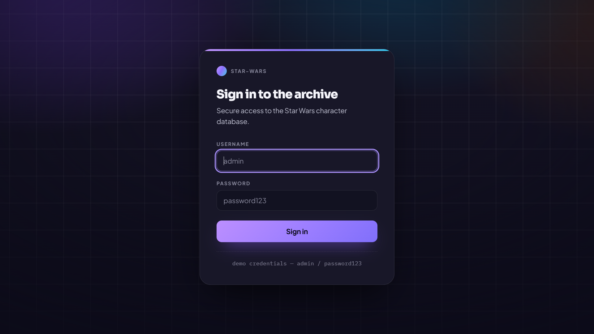
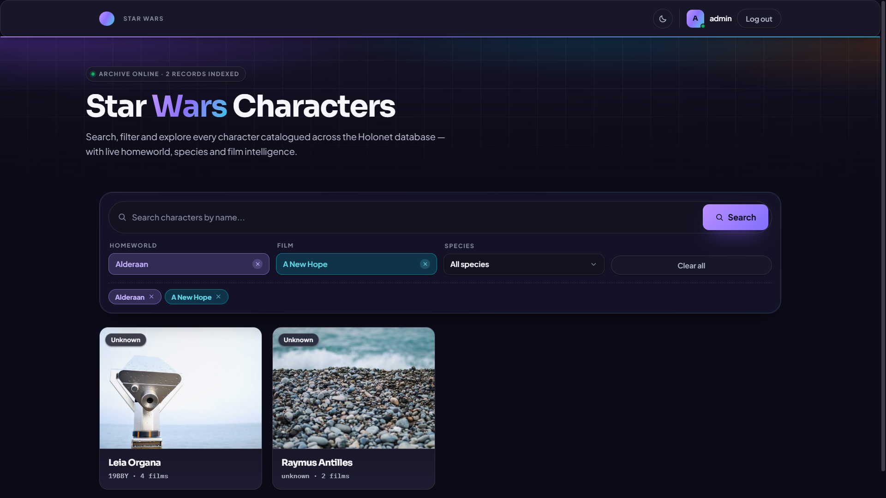
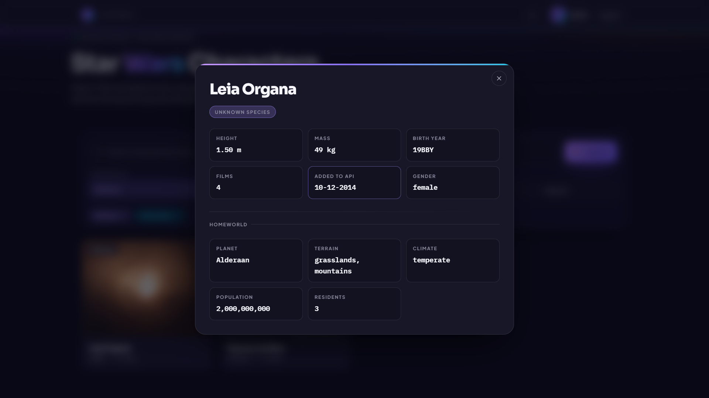
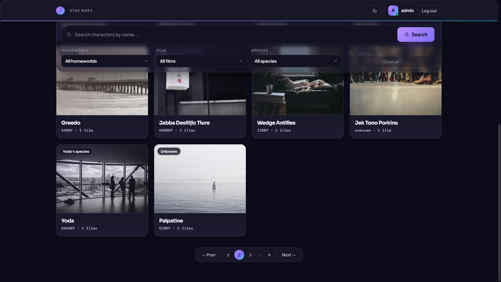
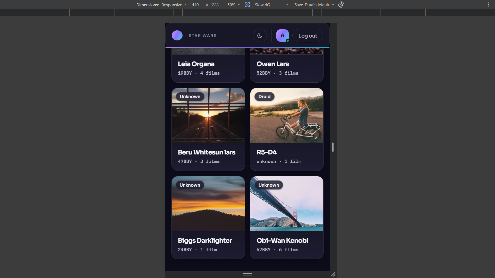
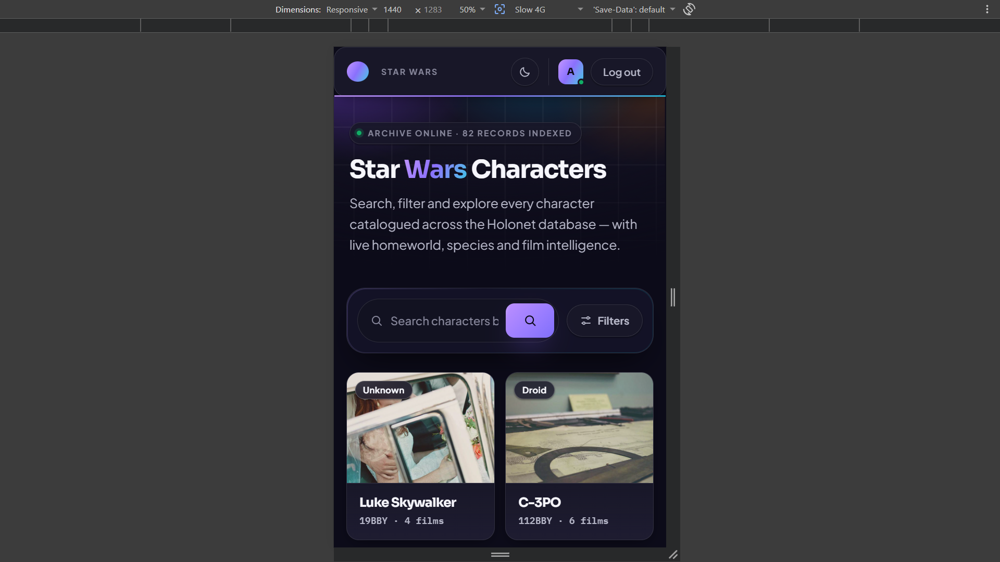
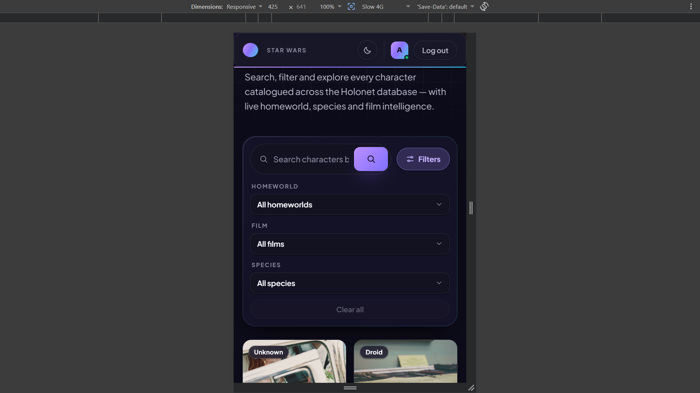

# 🌌 Star Wars Character Explorer

A modern React + TypeScript application that displays Star Wars characters using the SWAPI API. The app includes JWT authentication, advanced filtering, responsive UI, and a Node.js + Express backend for mock authentication.

## 🚀 Live Demo

- **Frontend:** https://tsx-mern-5-aug2026-6mc1h03ki-career-elevate.vercel.app/


## 🎥 Demo Video

Google Drive: https://your-video-link


## 📸 Screenshots

### Desktop

<p align="center">
  
  
</p>

<p align="center">
  
  
</p>

<p align="center">
  
</p>

### Mobile

<p align="center">
  
  
  
</p>

## ✨ Features

- JWT Authentication with Silent Refresh
- Character Listing using SWAPI
- Search by Name
- Filter by Species, Film & Homeworld
- Client-side Pagination
- Character Detail Modal
- Loading & Error States
- Responsive Design
- React Query Data Caching
- TypeScript throughout the application
- Integration Testing (Vitest + React Testing Library)

---

## 🛠 Tech Stack

### Frontend
- React 18
- TypeScript
- Vite
- TanStack Query
- CSS

### Backend
- Node.js
- Express.js
- MongoDB
- JWT Authentication

---

## 📂 Project Structure

```
client/     # React + TypeScript Frontend
server/     # Express Authentication API
```

---

## ⚙️ Setup

### Backend

```bash
cd server
npm install
npm run dev
```

### Frontend

```bash
cd client
npm install
npm run dev
```

---

## 🧪 Run Tests

```bash
cd client
npm run test
```

---

## 📌 Notes

- Character data is fetched directly from **SWAPI**.
- Backend is used only for authentication.
- React Query is used for caching and data management.
- Built following clean architecture and industry-standard coding practices.

---

## 👨‍💻 Author

**Akshat Kumar Singh**

